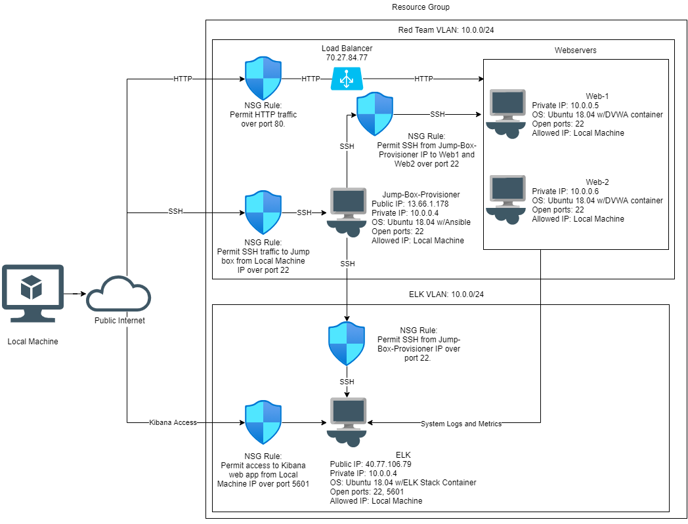
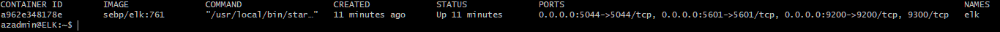
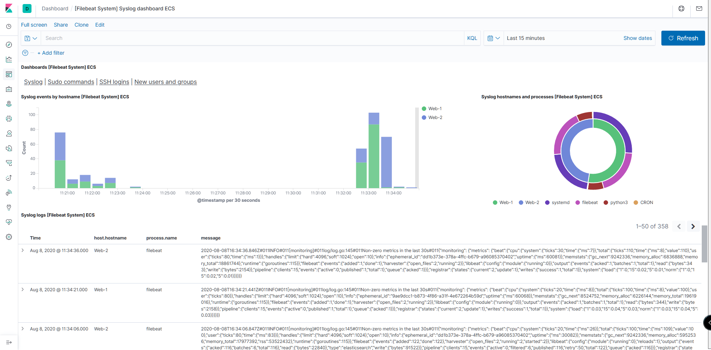

# Automated ELK Stack Deployment

The files in this repository were used to configure the network depicted below.

[These files](https://github.com/slyhy/azure_cloud_deployment/tree/master/ansible_playbooks) have been tested and used to generate a live ELK deployment on Azure. They can be used to either recreate the entire deployment pictured above. Alternatively, select portions of the `Beat Installation Playbook` may be used to install only certain pieces of it, such as Filebeat or Metricbeat.

  * [DVWA Deployment Playbook](ansible_playbooks/DVWA_deployment.yml)
  * [ELK Deployment Playbook](ansible_playbooks/elk_deployment.yml)
  * [Beat Installation Playbook](ansible_playbooks/beat_install.yml)

This document contains the following details:
- Description of the Topology
- Access Policies
- ELK Configuration
  - Machines Being Monitored
  - Beats in Use
- How to Use the Ansible Playbook
- - -
## Description of the Topology

The main purpose of this network is to expose a load-balanced and monitored instance of DVWA, the D*mn Vulnerable Web Application.

Load balancing ensures that the application will be highly available, while the jump box restricts access to the network.
- Load balancers focus on network availability by taking incoming traffic and distributing it among the available virtual machines. 
- The jump box behaves as a point of access for the user, so that access to the internal network is restricted.

Integrating an ELK server allows users to easily monitor the vulnerable VMs for changes to the logs and system metrics.
- Filebeat collects, parses and vizualizes logs from the system or other modules and forwards them to Kibana. 
- Metricbeat collects and ships different system and service metrics (e.g. CPU and memory usuage) and forwards them to Kibana.

The configuration details of each machine may be found below.

| Name     | Function | IP Address | Operating System |
|----------|----------|------------|------------------|
| Jump Box | Gateway  | 10.0.0.4   | Linux w/Ansible container|
| Web-1    | Webserver| 10.0.0.5   | Linux w/DVWA container|
| Web-2    | Webserver| 10.0.0.6   | Linux w/DVWA container|
| ELK      | ELK Stack| 10.1.0.4   | Linux w/ELK container |
- - -
## Access Policies

The machines on the internal network are not exposed to the public internet. 

* Only the Jump Box machine can accept connections from the public internet. 
* Access to the Jump Box is only allowed from my local IP address.
* Machines within the  network can only be accessed by the Jump Box.
* The Kibana web app, which is hosted one the ELK VM, can only be accessed through the public internet by my `local IP address` over port 5601.

A summary of the access policies in place can be found in the table below.

| Name     | Publicly Accessible | Allowed IP Addresses |
|----------|---------------------|----------------------|
| Jump Box | Yes                 | Local IP Address           |
| Load Balancer | Yes            | All HTTP traffic over port 80|
| Web-1    | No                  | 10.0.0.4             |
| Web-2    | No                  | 10.0.0.4             |
| ELK      | Yes                 | 10.0.0.4 and Local IP       |   
- - -
## Elk Configuration

Ansible was used to automate configuration of the ELK machine. No configuration was performed manually, which is advantageous because a properly configured playbook allows for the simple and correct deployment ELK or other containers without the need of `SSH`ing into several machines.  

The playbook implements the following tasks:
- Installs docker.io and python3-pip using apt module
- Install docker module using pip module
- Inscrease virtual memory and configure system to increase virtal memory on restart.
- Download and launch ELK container

The following screenshot displays the result of running `docker ps` after successfully configuring the ELK instance.

### Target Machines & Beats
This ELK server is configured to monitor the following machines:

| Machine Name | IP Address |
| ------------ |----------  |
| Web-1        | 10.0.0.5   |
| Web-2        | 10.0.0.6   |

We have installed the following Beats on these machines:
- Filebeat
- Metricbeat

These Beats allow us to collect the following information from each machine:
- Filebeat is used to collect system logs such as system.syslog which records system events. 
- Metricbeat is used to collect information on different system metrics like CPU usage.  
- - - 
## Using the Playbook
In order to use the playbook, you will need to have an Ansible control node already configured. Assuming you have such a control node provisioned: 

SSH into the control node and follow the steps below:
- Copy the elk_deployment.yml file to /etc/ansible/.
- Update the elk_deployment.yml file to include host name where you want to install the playbook (e.g. elk).
- Run the playbook, and navigate to Kibana web app (ELK_VM_IP:5601/app/kibana) to check that the installation worked as expected.

